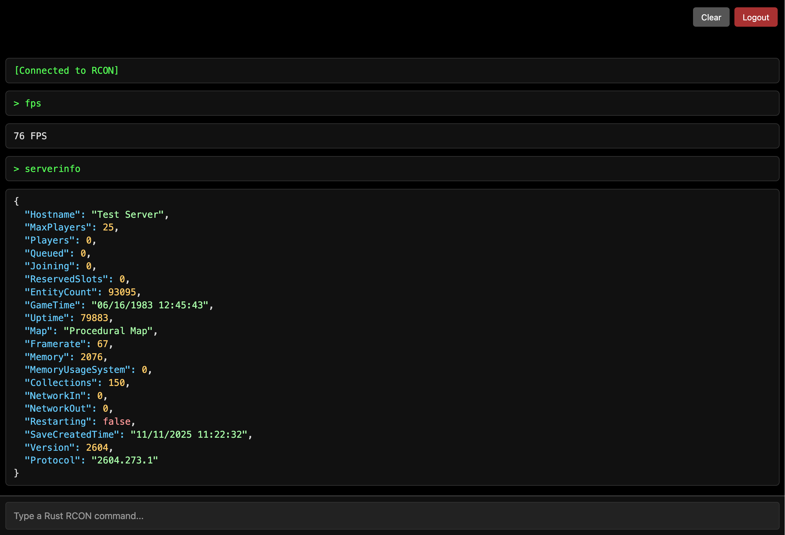

> Get yourself a VPS (use Ubuntu, not Debian)

https://www.ovhcloud.com/en-gb/vps/

> Confgure your VPS, Install Docker & Caddy

```
timedatectl set-timezone Europe/London
```

https://docs.docker.com/engine/install/ubuntu/

https://caddyserver.com/docs/install#debian-ubuntu-raspbian

> Download (this) repository

```
git clone --depth 1 https://github.com/herheliuk/rust-game-server ./rust-game-server/
cd ./rust-game-server/
```

> Confgure Your Rust Server & Website

```
nano docker-compose.yaml
```

> Launch the containers

```
sudo docker compose up -d
```

> Connect to the container

```
sudo docker exec -it rust-dedicated bash
```

> View logs (inside the container, will appear in a minute)

```
tail -f ./ds_last.log
```

> How to use RCON?

on your VPS, run:

```
docker exec -it rust-rcon-website ./rcon.py
```

or

use your website you specified earlier in caddy



Note that server admins also can use it in game via F1 or `/cp` (thanks to Carbon).

Sometimes you need to escape your input, e.g. `server.description \"Server Description\"`

> Add yourself as an admin

using rcon

or inside the container:

```
nano ./server/my_server_identity/cfg/users.cfg
```

paste-in this (tweak it first):

```
ownerid <Steam64ID> "<Your Name>" "<Reason>"
```

Note that you can see your `Steam64ID` in logs when you connect to the server.

> How to wipe the map? (inside the container)

```
rm ./server/server.seed
exit
```

and using rcon:

```
restart 300
```

or (in projct folder on your VPS)

```
docker compose down
docker compose up -d
```

Note that you need to wipe and restart at least once a month (on the first Thursday at 6pm PST), since Rust Developers update their software and your server won't be available without the new updates.

> How to add plugins?

use in game carbon panel `/cp`

click green gear at the top right

Turn off `Disable uMod (Plugins tab)`

wait a bit for them to load

you can configure them in plugins tab,

switch to Codefilng and back to update the state of the page

or

On your VPS:

```
mkdir ./volume/
```

Then add your plugins in that folder (You may use SSH in VSCode or `scp` command)

and then mount the voulme like this:

```
sudo docker run -it --rm -v ./volume/:/volume/ -v rust-game-server_carbon:/carbon/ debian:stable-slim
```

now move the plugins with a command:

```
cp /volume/* /carbon/plugins/
```
